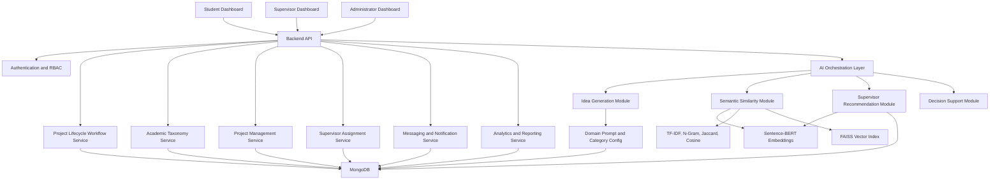
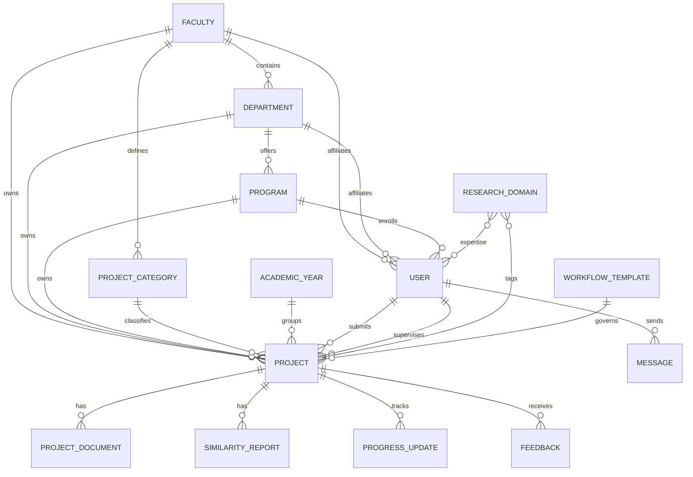
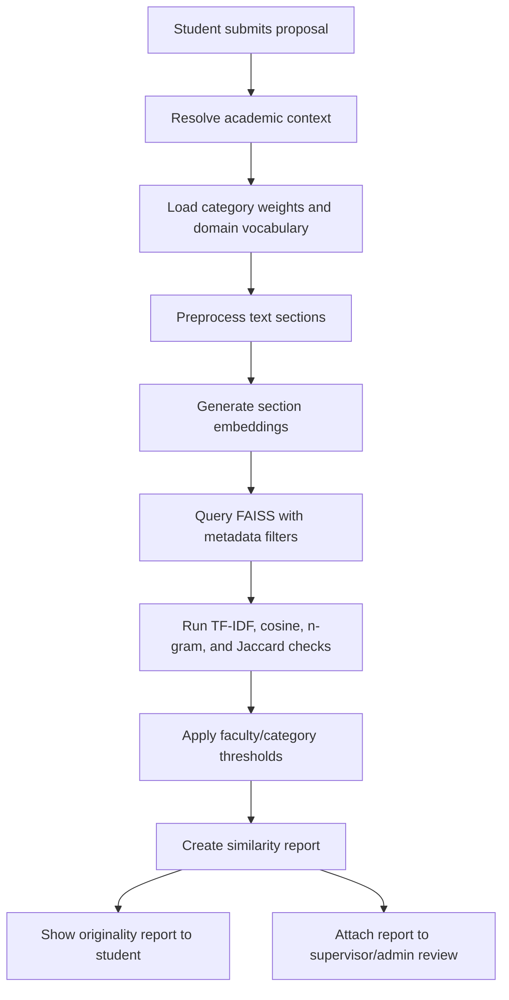

# Multi-Faculty Generalization Design

## Purpose

This document redesigns the existing AI-based final year project lifecycle management system so it can serve all faculties, departments, and programs in the university while preserving the original research scope.

The system remains focused on:

- Final year project lifecycle management
- AI-assisted project idea generation
- Semantic similarity and originality validation
- Intelligent supervisor recommendation
- Supervisor workload balancing
- Proposal review, feedback, and approval workflows
- Project progress tracking and academic decision support

It must not become a general university ERP. Course registration, tuition/payment, hostel, library, full LMS, and full student grading modules are outside the scope.

## Current System Fit

The current codebase already has the core lifecycle foundation:

- Frontend dashboards for students, supervisors, and administrators.
- Backend project, user, message, announcement, guideline, and curated idea models.
- Project proposal submission, review status, feedback, messaging, supervisor assignment, and archived project flows.
- AI-related services for semantic similarity, idea generation, and supervisor matching.
- Existing data concepts for department, supervisor expertise, project technology tags, similarity reports, and workload.

The main limitation is that academic context is represented mostly as free-text fields such as `department`, while many UI labels and examples assume Computing-style projects, technologies, and departments. The redesign should replace those assumptions with dynamic academic taxonomy and domain metadata.

## Design Principles

1. Keep the core lifecycle unchanged.
   Every faculty uses the same project idea, proposal, originality, assignment, review, tracking, and archive flow.

2. Make academic structure configurable.
   Faculties, departments, programs, research domains, project categories, deadlines, and review rules must be database records, not hardcoded frontend or backend logic.

3. Make AI context-aware, not faculty-specific.
   The same NLP, embedding, similarity, FAISS, TF-IDF, cosine similarity, Jaccard, n-gram, and recommendation components should accept an `academicContext` object.

4. Support controlled cross-faculty behavior.
   A Medicine project can be compared mostly with Medicine and health domains, but cross-faculty matches such as AI in healthcare or biomedical devices should still be possible through shared research domains.

5. Preserve thesis alignment.
   Scaling to all faculties is treated as generalizing the final year project lifecycle platform, not expanding into unrelated university administration.

## Generalized Architecture



## Academic Taxonomy Model

Replace hardcoded faculty or department assumptions with database-driven academic taxonomy.

Core hierarchy:

- `Faculty`: Computing, Engineering, Medicine, Business, Education, Agriculture, and future faculties.
- `Department`: belongs to a faculty.
- `Program`: belongs to a department, such as BSc Computer Science, Civil Engineering, Public Health, Accounting, or Agricultural Economics.
- `AcademicYear`: controls annual project cycles, deadlines, and reporting periods.
- `ResearchDomain`: reusable domain labels such as Artificial Intelligence, Public Health, Renewable Energy, Agribusiness, Curriculum Design, Cybersecurity, Finance, Soil Science, Biomedical Devices.
- `ProjectCategory`: faculty-aware categories such as software system, case study, experimental study, design project, field research, business analysis, teaching intervention, clinical audit.
- `WorkflowTemplate`: lifecycle stages and rules per faculty, department, program, or project category.

The frontend should request taxonomy options from the API and render forms based on the selected context.

## Dynamic Database Schema Improvements

### Faculty

```js
{
  name: String,
  code: String,
  description: String,
  isActive: Boolean,
  createdAt: Date
}
```

### Department

```js
{
  facultyId: ObjectId,
  name: String,
  code: String,
  isActive: Boolean
}
```

### Program

```js
{
  facultyId: ObjectId,
  departmentId: ObjectId,
  name: String,
  level: String,
  code: String,
  isActive: Boolean
}
```

### ResearchDomain

```js
{
  name: String,
  aliases: [String],
  keywords: [String],
  relatedDomainIds: [ObjectId],
  facultyIds: [ObjectId],
  isActive: Boolean
}
```

### ProjectCategory

```js
{
  facultyId: ObjectId,
  departmentId: ObjectId,
  name: String,
  description: String,
  expectedOutputs: [String],
  requiredProposalFields: [String],
  similarityWeights: {
    title: Number,
    abstract: Number,
    problemStatement: Number,
    objectives: Number,
    methodology: Number,
    keywords: Number
  },
  isActive: Boolean
}
```

### User

The current `User` model should move from a single `department` string to structured academic affiliation.

```js
{
  name: String,
  email: String,
  password: String,
  role: ["student", "supervisor", "admin"],
  facultyId: ObjectId,
  departmentId: ObjectId,
  programId: ObjectId,
  studentProfile: {
    studentId: String,
    cohortYear: Number,
    specialization: String
  },
  supervisorProfile: {
    expertiseDomainIds: [ObjectId],
    expertiseKeywords: [String],
    cvSummary: String,
    maxProjects: Number,
    currentProjects: Number,
    crossFacultyEligible: Boolean,
    availableForAssignment: Boolean
  },
  status: "active" | "inactive"
}
```

### Project

The current `Project` model should keep title, abstract, features, status, similarity, student, supervisor, and feedback, but add structured academic context.

```js
{
  title: String,
  abstract: String,
  problemStatement: String,
  objectives: [String],
  methodology: String,
  expectedOutputs: [String],
  keywords: [String],
  toolsOrMethods: [String],

  facultyId: ObjectId,
  departmentId: ObjectId,
  programId: ObjectId,
  academicYearId: ObjectId,
  categoryId: ObjectId,
  researchDomainIds: [ObjectId],

  student: ObjectId,
  supervisor: ObjectId,
  status: String,
  lifecycleStageId: ObjectId,

  similarityScore: Number,
  similarityRisk: "Low" | "Medium" | "High",
  similarityReportId: ObjectId,

  archivedStudentName: String,
  archivedYear: Number,
  submissionDate: Date,
  lastUpdated: Date,
  feedback: [{
    fromUserId: ObjectId,
    fromRole: String,
    message: String,
    date: Date
  }]
}
```

### SimilarityReport

```js
{
  projectId: ObjectId,
  academicContext: {
    facultyId: ObjectId,
    departmentId: ObjectId,
    programId: ObjectId,
    categoryId: ObjectId,
    researchDomainIds: [ObjectId]
  },
  overallScore: Number,
  riskLevel: String,
  breakdown: {
    title: Number,
    abstract: Number,
    problemStatement: Number,
    objectives: Number,
    methodology: Number,
    keywords: Number
  },
  matchedProjects: [{
    projectId: ObjectId,
    title: String,
    facultyId: ObjectId,
    departmentId: ObjectId,
    categoryId: ObjectId,
    score: Number,
    matchedSections: [String],
    reason: String
  }],
  modelVersion: String,
  createdAt: Date
}
```

### WorkflowTemplate

```js
{
  name: String,
  facultyId: ObjectId,
  departmentId: ObjectId,
  programId: ObjectId,
  categoryId: ObjectId,
  stages: [{
    key: String,
    label: String,
    order: Number,
    requiredRoleAction: String,
    requiredDocuments: [String],
    deadlineOffsetDays: Number
  }],
  isDefault: Boolean,
  isActive: Boolean
}
```

## Entity Relationship Design



## Updated Student Dashboard Structure

The student dashboard should be generated from the student's `academicContext`.

Core sections:

- Context header: faculty, department, program, academic year, current project stage.
- AI idea assistant: uses faculty, department, program, domains, categories, and project type.
- Proposal workspace: dynamic fields based on project category.
- Originality checker: semantic similarity report with same-department, same-faculty, related-domain, and university-wide matches.
- Lifecycle tracker: proposal, review, approval, progress, defense, archive.
- Supervisor panel: assigned supervisor profile, expertise, workload status, response channel.
- Messages and feedback: supervisor/admin communication.
- Deadlines and notifications: faculty or program-specific due dates.
- Revision history: proposal versions, uploaded documents, and feedback cycles.
- Project history: submitted, rejected, approved, completed, or archived projects.

Dynamic examples:

- Computing: labels emphasize system features, technologies, datasets, algorithms, and software outputs.
- Medicine: labels emphasize clinical problem, study design, ethics, population, methodology, and health outcome.
- Engineering: labels emphasize design requirements, materials, simulations, prototype, testing, and safety constraints.
- Business: labels emphasize market problem, business model, financial/operational analysis, research method, and recommendations.
- Education: labels emphasize pedagogy, curriculum, learner population, intervention, assessment, and classroom impact.
- Agriculture: labels emphasize crop/livestock domain, field setting, soil/water constraints, method, and productivity impact.

## Updated Supervisor Dashboard Structure

The supervisor dashboard should support supervisors across one or more faculties.

Core sections:

- Workload summary: assigned projects, pending reviews, max capacity, active/completed counts.
- Expertise profile: research domains, keywords, CV summary, cross-faculty availability.
- Proposal inbox: filter by faculty, department, program, category, domain, risk level, and status.
- AI match explanation: why this supervisor was recommended for a project.
- Similarity validation: view originality report before approval.
- Review actions: approve, reject, request changes, escalate to admin, or mark as in progress.
- Student progress monitor: milestones, documents, meetings, feedback, and defense readiness.
- Communication: messages, files, comments, and announcement visibility.
- Multi-faculty queue: separate assignments from home faculty and cross-faculty projects.

## Updated Administrator Dashboard Structure

The administrator dashboard becomes the centralized university-wide control center for final year projects only.

Core sections:

- University overview: project counts, risk levels, approval rates, workload, and completion trends.
- Dynamic filters: faculty, department, program, academic year, category, domain, supervisor, status, risk.
- Academic taxonomy management: faculties, departments, programs, domains, categories, workflow templates, deadlines.
- User and role management: students, supervisors, admins, affiliations, expertise, capacity.
- Supervisor assignment control: AI recommendations, workload balancing, manual override, assignment history.
- Similarity monitoring: high-risk submissions, matched archives, duplicate clusters, originality reports.
- Curated idea management: faculty/domain-aware idea seeds and strategic research themes.
- Guideline and announcement management: targeted by faculty, department, program, role, or academic year.
- Analytics and reporting: faculty statistics, department performance, supervisor load, lifecycle bottlenecks.
- AI system management: model version, thresholds, similarity weights, domain vocabulary, FAISS index rebuild status.

## Faculty-Aware AI Workflow Design

All AI services should accept this shared context object:

```js
{
  facultyId,
  departmentId,
  programId,
  academicYearId,
  categoryId,
  researchDomainIds,
  projectType,
  userRole,
  language,
  keywords
}
```

### AI idea generation

1. Resolve the student's academic context.
2. Load the matching project category and research domain metadata.
3. Build a domain-aware prompt using allowed outputs and proposal requirements.
4. Generate ideas with title, problem, objectives, methodology, expected output, difficulty, and keywords.
5. Compare generated ideas against archived projects before showing them.
6. Rank ideas by originality, relevance, feasibility, and supervisor availability.

### Semantic similarity detection

1. Normalize title, abstract, problem statement, objectives, methodology, keywords, and outputs.
2. Generate Sentence-BERT embeddings for each relevant section.
3. Store embeddings with metadata filters: faculty, department, program, category, domains, academic year, status.
4. Query FAISS using the new proposal embedding.
5. Run secondary text metrics: TF-IDF, n-gram overlap, Jaccard similarity, and cosine similarity.
6. Apply category-specific weights from `ProjectCategory.similarityWeights`.
7. Return same-domain, same-faculty, related-domain, and university-wide matches.
8. Save a `SimilarityReport` for audit and supervisor review.

Suggested default score:

```text
overall =
  semantic_embedding_score * 0.55 +
  tfidf_cosine_score * 0.20 +
  ngram_overlap_score * 0.10 +
  jaccard_keyword_score * 0.10 +
  same_domain_boost * 0.05
```

Risk thresholds can be global defaults, then overridden by faculty/category:

- Low: less than 35
- Medium: 35 to 69
- High: 70 or higher

## Multi-Faculty Supervisor Recommendation Logic

Supervisor matching should not rely only on department equality. It should combine semantic expertise, domain overlap, workload, project history, and policy constraints.

Suggested scoring:

```text
matchScore =
  semantic_similarity(project_text, supervisor_profile) * 0.40 +
  research_domain_overlap * 0.20 +
  previous_project_relevance * 0.15 +
  workload_capacity_score * 0.15 +
  faculty_policy_score * 0.10
```

Pseudocode:

```js
function recommendSupervisors(project, supervisors, context) {
  return supervisors
    .filter(supervisor => supervisor.availableForAssignment)
    .filter(supervisor => supervisor.currentProjects < supervisor.maxProjects)
    .filter(supervisor =>
      supervisor.facultyId === project.facultyId ||
      supervisor.crossFacultyEligible ||
      sharesResearchDomain(supervisor, project)
    )
    .map(supervisor => {
      const semanticScore = cosine(
        embed(project.title + project.abstract + project.keywords.join(" ")),
        embed(supervisor.cvSummary + supervisor.expertiseKeywords.join(" "))
      );
      const domainScore = overlap(project.researchDomainIds, supervisor.expertiseDomainIds);
      const historyScore = similarityToPreviousSupervisedProjects(project, supervisor);
      const workloadScore = 1 - supervisor.currentProjects / supervisor.maxProjects;
      const policyScore = policyCompatibility(project, supervisor, context);

      return {
        supervisorId: supervisor.id,
        matchScore: weightedScore(semanticScore, domainScore, historyScore, workloadScore, policyScore),
        reason: explainMatch(semanticScore, domainScore, historyScore, workloadScore, policyScore)
      };
    })
    .sort((a, b) => b.matchScore - a.matchScore)
    .slice(0, 5);
}
```

Recommendation explanations should be stored so admins and supervisors can audit AI-assisted decisions.

## Dynamic Semantic Similarity Workflow



## Multi-Faculty Workflow Diagram

```mermaid
flowchart LR
    A["Admin configures faculties, departments, programs, domains"] --> B["Student profile receives academic context"]
    B --> C["Student generates or submits project proposal"]
    C --> D["AI validates originality"]
    D --> E{"Similarity risk"}
    E -->|Low or Medium| F["Supervisor recommendation"]
    E -->|High| G["Supervisor/admin originality review"]
    G --> F
    F --> H["Admin assigns supervisor or confirms AI match"]
    H --> I["Supervisor reviews proposal"]
    I -->|Approve| J["Project in progress"]
    I -->|Request changes| C
    I -->|Reject| K["Student revises or submits new topic"]
    J --> L["Progress tracking and feedback"]
    L --> M["Defense readiness"]
    M --> N["Completed project archive"]
    N --> O["Embeddings added to FAISS for future checks"]
```



## Updated Use Cases

| Use case | Actor | Description |
| --- | --- | --- |
| Generate faculty-aware project ideas | Student | Student enters interests, and AI generates ideas based on faculty, department, program, research domains, and project category. |
| Submit proposal | Student | Student submits a proposal using dynamic fields required by the selected project category. |
| Check originality | Student, Supervisor, Admin | System compares the proposal against archived and active projects using semantic and lexical similarity. |
| Recommend supervisor | Admin | System ranks supervisors based on expertise, domain match, workload, history, and policy. |
| Review proposal | Supervisor | Supervisor reviews content, similarity report, and student context before approval or feedback. |
| Monitor progress | Student, Supervisor | Student uploads progress, supervisor gives feedback, lifecycle stage updates. |
| Manage academic taxonomy | Admin | Admin adds faculties, departments, programs, domains, project categories, and workflows without code changes. |
| Monitor university-wide projects | Admin | Admin filters and analyzes project lifecycle data across faculties and departments. |
| Manage AI configuration | Admin | Admin updates thresholds, category weights, domain keywords, and index rebuild settings. |

## Scalable Backend Architecture Recommendations

Recommended backend modules:

- `taxonomy`: faculty, department, program, domain, category, academic year APIs.
- `projects`: proposals, documents, lifecycle, feedback, archive.
- `ai`: idea generation, similarity report, recommendation, decision support.
- `assignments`: supervisor ranking, assignment, workload updates, audit trail.
- `workflow`: lifecycle stages, deadlines, status transitions.
- `analytics`: dashboards, filters, reports.
- `notifications`: role and context-aware alerts.
- `users`: RBAC, academic affiliation, supervisor profiles.

Suggested API endpoints:

```text
GET    /api/taxonomy/faculties
GET    /api/taxonomy/departments?facultyId=
GET    /api/taxonomy/programs?departmentId=
GET    /api/taxonomy/domains?facultyId=&departmentId=
GET    /api/taxonomy/project-categories?facultyId=&departmentId=

POST   /api/projects
GET    /api/projects?facultyId=&departmentId=&programId=&status=&risk=
PUT    /api/projects/:id/submit
PUT    /api/projects/:id/stage
POST   /api/projects/:id/documents

POST   /api/ai/ideas
POST   /api/ai/similarity/check
GET    /api/ai/similarity/reports/:projectId
POST   /api/ai/supervisors/recommend

POST   /api/assignments
GET    /api/assignments/recommendations/:projectId
PUT    /api/assignments/:id/confirm
```

## Dynamic Role-Based Access Structure

| Role | Scope | Permissions |
| --- | --- | --- |
| Student | Own faculty, department, program, and own projects | Generate ideas, submit proposals, upload documents, view reports, message supervisor, track lifecycle. |
| Supervisor | Own assignments and eligible proposal queues | Review proposals, view similarity reports, approve/reject/request changes, monitor progress, message students. |
| Faculty admin | Assigned faculty or departments | Manage faculty projects, supervisors, workflows, reports, and assignments. |
| System admin | University-wide | Manage all taxonomy, roles, AI settings, reports, guidelines, and system-wide oversight. |

The existing `admin`, `supervisor`, and `student` roles can remain, but permission checks should include academic scope. For example, a faculty admin can manage projects only where `project.facultyId` is in the admin's allowed scope.

## Updated Project Lifecycle Process

1. Admin configures academic taxonomy, project categories, deadlines, and workflow templates.
2. Student account is linked to faculty, department, and program.
3. Student generates AI-assisted project ideas using academic context.
4. Student submits a proposal with category-specific fields.
5. System performs semantic similarity and originality validation.
6. Student receives originality report and recommendation feedback.
7. AI recommends supervisors using expertise, domains, workload, and policy.
8. Admin confirms or overrides supervisor assignment.
9. Supervisor reviews proposal, similarity report, and student context.
10. Proposal is approved, rejected, or returned for changes.
11. Approved project enters progress tracking.
12. Student and supervisor exchange feedback, documents, and milestones.
13. Project moves to completion or defense-ready status.
14. Completed project is archived with metadata and embeddings.
15. Archive improves future similarity checks and decision support.

## Preserving Thesis Scope While Scaling

The redesign remains aligned with the original thesis because it generalizes the same research problem: intelligent management of final year academic projects. The expansion is horizontal across faculties, not vertical into unrelated university operations.

Keep inside scope:

- Project ideas, proposals, originality, assignment, tracking, supervisor feedback, AI recommendations, analytics.

Keep outside scope:

- Course enrollment, fee payment, hostel allocation, library circulation, full LMS delivery, exam grading, payroll, HR, procurement.

The thesis can frame this as:

"A configurable, multi-faculty extension of an AI-based final year project lifecycle management platform that uses NLP and machine learning to support originality validation, supervisor recommendation, workflow automation, and academic decision support across diverse university research domains."

## Migration Plan From Current Implementation

| Current item | Generalized replacement |
| --- | --- |
| `User.department: String` | `facultyId`, `departmentId`, `programId`, plus optional display name population |
| `User.expertise: [String]` | `supervisorProfile.expertiseDomainIds` and `expertiseKeywords` |
| `Project.department: String` | `facultyId`, `departmentId`, `programId`, `categoryId`, `researchDomainIds` |
| `technologies` as Computing-only mental model | `toolsOrMethods`, with faculty/category-specific labels in the UI |
| Hardcoded department dropdowns | API-driven taxonomy selectors |
| Computing-specific idea examples | Domain-seeded prompts from `ResearchDomain` and `ProjectCategory` |
| Global similarity weights | Category-specific similarity weights |
| Supervisor assignment by expertise strings | Embedding plus domain, workload, history, and policy scoring |
| Admin charts with fixed departments | Filterable analytics by taxonomy records |

Recommended implementation order:

1. Add taxonomy models and seed initial faculties, departments, programs, domains, and project categories.
2. Extend `User` and `Project` schemas with structured academic IDs while keeping old `department` temporarily for migration.
3. Add taxonomy API endpoints and replace hardcoded frontend dropdowns.
4. Update student proposal forms to use project category configuration.
5. Update similarity service to store reports with academic context and configurable weights.
6. Update supervisor recommendation to use domain IDs, embeddings, workload, and cross-faculty policy.
7. Update admin filters, analytics, assignment, and user management screens.
8. Migrate existing projects and users from free-text departments into taxonomy IDs.
9. Rebuild FAISS indexes with academic metadata.
10. Remove fallback hardcoded department logic after migration verification.

## Acceptance Criteria

- A new faculty can be added by an admin without changing frontend or backend code.
- A department and program can be attached to the new faculty through taxonomy records.
- Students in different faculties see context-relevant proposal fields, idea prompts, and recommendations.
- Semantic similarity works across same faculty, same domain, related domains, and university-wide archives.
- Supervisor recommendation ranks supervisors using expertise, domains, workload, history, and cross-faculty rules.
- Administrator dashboards can filter by faculty, department, program, academic year, project category, domain, status, and risk.
- No unrelated ERP modules are introduced.
- Existing thesis objectives remain visible in the architecture and workflows.
